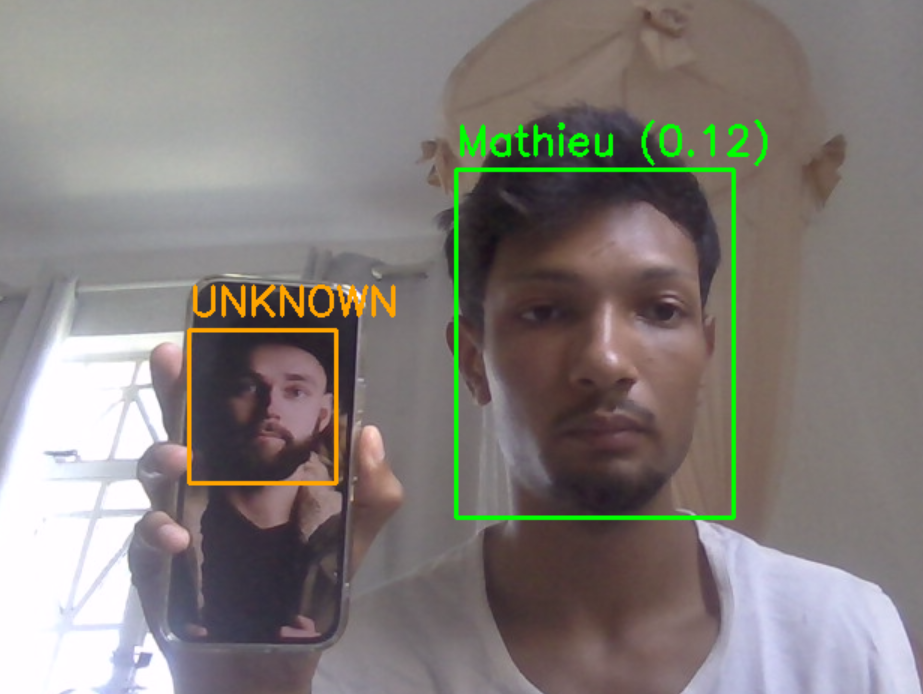

# Système de Reconnaissance Faciale

Un système intelligent de reconnaissance faciale en temps réel qui combine la détection YOLO et les embeddings FaceNet pour identifier les visages connus et gérer les visages inconnus.

<p align="center">
  
</p>

---

## Description

Ce projet implémente une solution complète de reconnaissance faciale en temps réel avec les fonctionnalités suivantes :

- **Détection des visages** : Utilise un modèle YOLO entraîné pour détecter les visages dans le flux vidéo
- **Reconnaissance faciale** : Extraction d'embeddings avec FaceNet et comparaison cosinus pour identifier les personnes
- **Gestion des visages inconnus** : Accumulation intelligente d'échantillons avec déduplication
- **Base de données persistante** : Stockage des embeddings dans PostgreSQL pour la gestion des personnes connues
- **Interface interactive** : Système d'enregistrement des visages détectés avec validation manuelle

---

## 🔧 Guide d'Installation

### Prérequis

- **Python 3.8+**
- **PostgreSQL 12+** (pour la base de données)
- **Webcam** (pour la capture vidéo)
- **CUDA 11.8+** (optionnel, pour accélération GPU)

### Étapes d'installation

#### 1. Cloner le projet et accéder au répertoire

```bash
git clone https://github.com/Math-Baba/Face_Recognition_YOLO_FaceNet.git
cd Face_Recognition_YOLO_FaceNet
```

#### 2. Créer un environnement virtuel

```bash
python -m venv venv
venv\Scripts\activate
```

#### 3. Installer les dépendances

```bash
pip install -r requirements.txt
```

**Dépendances principales :**
- `torch` et `torchvision` - Framework deep learning
- `ultralytics` - YOLO pour la détection
- `facenet-pytorch` - FaceNet pour les embeddings
- `opencv-python` - Traitement d'images et capture vidéo
- `psycopg2-binary` - Connecteur PostgreSQL
- `python-dotenv` - Gestion des variables d'environnement

#### 4. Configurer la base de données PostgreSQL

**Créer la base de données :**

```sql
-- Créer la base de données
CREATE DATABASE facial_recognition;
```

**Créer la table des personnes :**

```sql
-- Créer la table
CREATE TABLE persons (
    id SERIAL PRIMARY KEY,
    first_name VARCHAR(100) NOT NULL,
    embedding FLOAT8[] NOT NULL,
    created_at TIMESTAMP DEFAULT CURRENT_TIMESTAMP
);
```

#### 5. Configurer les variables d'environnement

Créer un fichier `.env` à la racine du projet :

```env
# Configuration PostgreSQL
DB_HOST=localhost
DB_NAME=facial_recognition
DB_USER=postgres
DB_PASSWORD=votre_mot_de_passe
```

#### 6. Télécharger le modèle YOLO

Le modèle YOLO doit être présent dans le dossier `models/` :

Si le fichier model.pt n'existe pas, vous pourrez le télécharger sur hugging face sur le lien suivant:

[Hugging Face YOLOv8 link](https://huggingface.co/arnabdhar/YOLOv8-Face-Detection/tree/main)

---

## Guide d'Utilisation

### 1. Lancer la reconnaissance faciale en temps réel

```bash
python app/main.py
```

**Fonctionnement :**
- La webcam s'ouvre et affiche le flux vidéo en temps réel
- Les visages **reconnus** s'affichent en **vert** avec le nom et la distance de confiance
- Les visages **inconnus** s'affichent en **orange**
- Les inconnus sont accumulés jusqu'à **5 échantillons** avant d'être enregistrés
- Appuyer sur **ESC** pour quitter

### 2. Enregistrer les visages inconnus (à faire correctement)

**Important — une seule personne à la fois :** pour éviter les mélanges d'embeddings et les mauvaises reconnaissances, enregistrez **une personne à la fois** devant la caméra.

**Étapes recommandées :**

1. **Lancer la reconnaissance**
   ```bash
   python app/main.py
   ```
2. **Faire apparaître une seule personne** devant la webcam (pas plusieurs).
3. **Attendre quelques secondes** : le visage doit rester marqué **UNKNOWN** (orange) le temps que 5 échantillons soient collectés (quelques secondes).
4. **Quitter** avec **ESC**.
5. **Enregistrer le visage**
   ```bash
   python app/register_faces.py
   ```
   - Choisir l’option **1** (Enregistrer) et saisir le prénom de la personne.
6. **Répéter pour chaque nouvelle personne** : relancer `main.py`, mettre **uniquement** la prochaine personne devant la caméra, attendre, quitter, puis lancer `register_faces.py` pour l’enregistrer.

**À éviter :**
- Plusieurs visages inconnus en même temps devant la caméra lors de la collecte (risque de mélanger les embeddings).
- Enregistrer plusieurs personnes d’un coup sans quitter et relancer entre chaque.

### 3. Enregistrer les visages inconnus détectés (détails)

```bash
python app/register_faces.py
```

**Fonctionnement :**
- Affiche les visages inconnus qui ont été détectés et sauvegardés
- Pour chaque visage, propose 4 options :
  1. **Enregistrer** : Associer un nom et ajouter à la base de données
  2. **Ignorer** : Sauter au visage suivant
  3. **Supprimer** : Effacer le visage de la base
  4. **Quitter** : Sortir du programme

### 4. Repartir de zéro (réinitialisation)

Si les reconnaissances sont incorrectes (noms mélangés, tout en UNKNOWN), vous pouvez repartir de zéro :

1. **Supprimer les visages inconnus locaux**  
   Supprimer le fichier : `data/unknown_faces/unknown_embeddings.pkl` (et éventuellement les images `.jpg` dans ce dossier).

2. **Vider la table des personnes** (dans PostgreSQL) :
   ```sql
   DELETE FROM persons;
   ```

3. **Réenregistrer chaque personne** en suivant les étapes du §2 (une personne à la fois).

### 5. Récupérer les visages inconnus

Les visages inconnus sont automatiquement sauvegardés dans :
```
data/unknown_faces/
├── unknown_YYYYMMDD_HHMMSS.jpg
├── unknown_embeddings.pkl
└── ...
```

---

## Détails du Fonctionnement Technique

### Architecture du Système

```
┌─────────────────────────────────────────────────────────┐
│                      Flux Principal                       │
└─────────────────────────────────────────────────────────┘
                            │
                            ▼
                  ┌──────────────────┐
                  │ Capture Webcam   │ (OpenCV)
                  │ (Frame par frame) │
                  └──────────────────┘
                            │
                            ▼
                  ┌──────────────────┐
                  │ Détection Visages│ (YOLO)
                  │ Bounding boxes   │
                  └──────────────────┘
                            │
                    ┌───────┴────────┐
                    ▼                ▼
            ┌──────────────┐  ┌──────────────┐
            │ Extraction   │  │ Extraction   │
            │ Embedding 1  │  │ Embedding N  │
            │ (FaceNet)    │  │ (FaceNet)    │
            └──────────────┘  └──────────────┘
                    │                │
                    └───────┬────────┘
                            ▼
                  ┌──────────────────┐
                  │ Comparaison      │
                  │ (Distance Cosinus)│
                  └──────────────────┘
                            │
                ┌───────────┼───────────┐
                ▼           ▼           ▼
          ┌────────┐  ┌────────┐  ┌────────┐
          │ Connu? │  │Distance│  │Enreg.? │
          │ (Seuil)│  │Affichée│  │Buffer  │
          └────────┘  └────────┘  └────────┘
```

### Étapes Détaillées

#### 1. **Détection des Visages (YOLO)**

```python
# Modèle : YOLODetector
faces = detector.detect_faces(frame, conf=0.6)
# Entrée :  Image RGB (hauteur, largeur, 3)
# Sortie : Liste de bounding boxes [(x1, y1, x2, y2), ...]
```

**Points clés :**
- Utilise le modèle YOLO entraîné (`model.pt`)
- Seuil de confiance : **0.6** (60%)
- Ajoute une marge de **10%** autour des visages détectés
- Utilise **GPU** si disponible, sinon **CPU**

#### 2. **Extraction d'Embedding (FaceNet)**

```python
# Modèle : FaceRecognizer
embedding = recognizer.get_embedding(face_crop)
# Entrée :  Visage détouché (50x50 minimum)
# Sortie : Vecteur de 512 dimensions normalisé (L2)
```

**Prétraitement :**
1. Conversion BGR → RGB
2. Redimensionnement à 160×160 pixels
3. Normalisation (mean=[0.5, 0.5, 0.5], std=[0.5, 0.5, 0.5])
4. Passage dans le modèle InceptionResnetV1 (VGGFace2)
5. Normalisation L2 pour comparaison fiable

#### 3. **Comparaison et Reconnaissance**

```python
# Distance cosinus entre deux embeddings
distance = 1.0 - np.dot(emb1_norm, emb2_norm)

# Si distance < MATCH_THRESHOLD (0.4) → Visage CONNU
# Sinon → Visage INCONNU
```

**Métriques :**
- **Distance = 0** : Visages identiques
- **Distance = 1** : Visages complètement différents
- **Seuil de reconnaissance** : 0.4 (ajustable)

#### 4. **Gestion des Visages Inconnus**

```
Visage inconnu détecté
        │
        ▼
Ajouter embedding au buffer (track_id)
        │
        ├─→ < 3 échantillons ? → Continuer
        │
        └─→ ≥ 3 échantillons ? → Calculer la moyenne
                                       │
                                       ▼
                            Vérifier les doublons
                            (distance < 0.25)
                                       │
                    ┌──────────────────┼──────────────────┐
                    ▼                  ▼                  ▼
            Doublon détecté    Doublon ignoré    Nouveau visage
            (Ignorer)          (Ignorer)         (Sauvegarder)
```

**Paramètres :**
- `SAMPLES_TO_SAVE = 3` : Nombre d'échantillons à accumuler
- `UNKNOWN_DUP_THRESHOLD = 0.25` : Seuil pour détecter les doublons d'inconnus
- `MATCH_THRESHOLD = 0.4` : Seuil de reconnaissance des personnes connues

#### 5. **Stockage en Base de Données (PostgreSQL)**

```python
# Insertion d'une nouvelle personne
INSERT INTO persons (first_name, embedding) 
VALUES ('Mathilde Debrune', [0.123, 0.456, ..., 0.789]);

# Récupération des personnes connues
SELECT first_name, embedding FROM persons;
```

### Composants Principaux

| Composant | Fichier | Rôle |
|-----------|---------|------|
| **Détecteur YOLO** | `detection/yolo_detector.py` | Détection des visages dans les images |
| **Reconnaisseur FaceNet** | `recognition/facenet_recognizer.py` | Extraction et comparaison d'embeddings |
| **Base de Données** | `database/postgres.py` | Gestion des personnes connues |
| **Gestionnaire d'Inconnus** | `unknown_faces.py` | Sauvegarde et gestion des visages inconnus |
| **Programme Principal** | `main.py` | Boucle de reconnaissance en temps réel |
| **Enregistrement** | `register_faces.py` | Interface d'enregistrement des inconnus |

### Performances

| Aspect | Valeur |
|--------|--------|
| **Détection YOLO** | ~30-50 ms par frame |
| **Extraction embedding** | ~50-100 ms par visage |
| **Comparaison** | < 1 ms par visage connu |
| **FPS (avec GPU)** | 15-25 fps |
| **FPS (sans GPU/CPU)** | 5-10 fps |

### Configuration des Seuils

Tous les seuils sont modifiables dans `main.py` :

```python
MATCH_THRESHOLD = 0.4           # ↑ Accepte plus de faux positifs
UNKNOWN_DUP_THRESHOLD = 0.25    # ↓ Plus de faux négatifs (doublons)
SAMPLES_TO_SAVE = 3             # ↓ Enregistrement plus rapide
```

**Recommandations :**
- **Sécurité maximale** : `MATCH_THRESHOLD = 0.25` (plus restrictif)
- **Confort maximal** : `MATCH_THRESHOLD = 0.5` (plus permissif)
- **Par défaut** : `MATCH_THRESHOLD = 0.4` (équilibré)

---

## Structure du Projet

```
Facial Recognition/
├── README.md                          # Documentation
├── requirements.txt                   # Dépendances Python
├── .env                              # Variables d'environnement (à créer)
│
├── app/                              # Code source principal
│   ├── main.py                       # Programme principal (reconnaissance)
│   ├── register_faces.py             # Enregistrement des inconnus
│   ├── unknown_faces.py              # Gestion des visages inconnus
│   │
│   ├── detection/                    # Module de détection
│   │   ├── __init__.py
│   │   └── yolo_detector.py          # Détecteur YOLO
│   │
│   ├── recognition/                  # Module de reconnaissance
│   │   ├── __init__.py
│   │   └── facenet_recognizer.py     # Reconnaisseur FaceNet
│   │
│   └── database/                     # Module de base de données
│       ├── __init__.py
│       └── postgres.py               # Gestionnaire PostgreSQL
│
├── models/                           # Modèles de deep learning
│   └── model.pt                      # Modèle YOLO entraîné
│
├── data/                             # Données
│   └── unknown_faces/                # Visages inconnus détectés
│
└── tests/                            # Tests unitaires
    ├── __init__.py
    ├── test_face_recognition.py
    ├── test_webcam.py
    └── test_yolo.py
```

---

## Dépannage

### Erreur : "Webcam introuvable"
```
[ERROR] Webcam introuvable
```
**Solutions :**
- Vérifier que la webcam est bien connectée
- Tester avec : `python -c "import cv2; cap = cv2.VideoCapture(0); print(cap.isOpened())"`
- Vérifier les permissions d'accès à la webcam

### Erreur : "Connection refused" (PostgreSQL)
```
psycopg2.OperationalError: could not connect to server
```
**Solutions :**
- Vérifier que PostgreSQL est démarré : `pg_isready`
- Vérifier les paramètres `.env` (host, port, user, password)
- S'assurer que la base de données `facial_recognition` existe

### Reconnaissance inexacte
- ↓ Augmenter `MATCH_THRESHOLD` pour être plus restrictif
- Réenregistrer les personnes (3 nouveaux échantillons)
- S'assurer que les conditions d'éclairage sont bonnes

### Faible performance (peu de fps)
- Ne pas utiliser d'autres applications gourmandes
- Utiliser CUDA si disponible : `pip install torch torchvision torchaudio --index-url https://download.pytorch.org/whl/cu118`
- Réduire la résolution d'entrée (modifier dans `yolo_detector.py`)

---

## Notes de Sécurité

- **Stockage d'embeddings** : Les vecteurs de visages ne permettent pas de reconstruire l'image originale
- **Données sensibles** : Gérer les fichiers `.env` et la base de données PostgreSQL avec attention
- **Précision** : Ce système n'est pas 100% fiable, utiliser avec prudence pour les applications critiques

---

## Auteur

- **Math-Baba** - [GitHub](https://github.com/Math-Baba)

